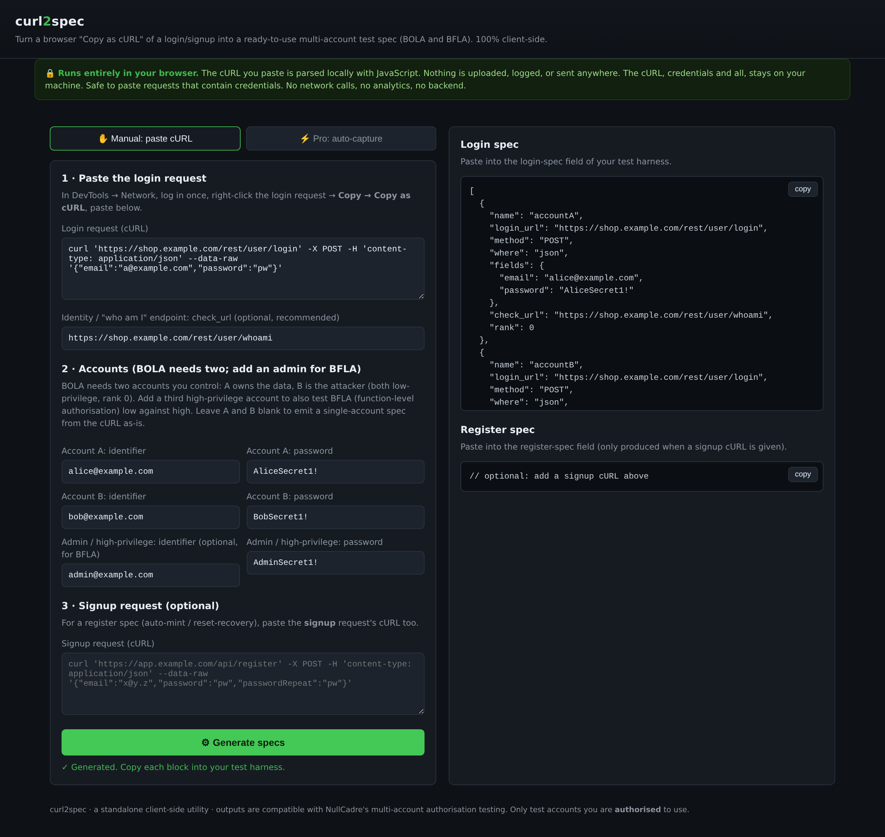

# curl2spec

**Turn a browser "Copy as cURL" of a login (and optionally a signup) request into a ready-to-use
multi-account authentication test spec.** It is the input an authenticated web-security scan needs to test
for broken object-level authorisation (BOLA / IDOR), broken function-level authorisation (BFLA), and broken
access control.

It automates the fiddly, error-prone step of hand-writing that JSON: reading a login request to find its URL,
whether the body is JSON or form-encoded, the exact field names, and the identity endpoint.

## What it produces

- **Login spec** from a single login request: URL, method, JSON-vs-form body, exact field names, static
  auth/API-key headers, and the identity `check_url`.
- **Two-account spec** for BOLA / IDOR: A owns the data, B is the attacker (both `rank: 0`).
- **Optional admin account** for BFLA: a third `rank: 2` account, so a harness can drive one identity against
  another (a low-privilege caller attempting a high-privilege function). Every account carries a `rank`.
- **Register spec** from a signup request: auto-mints fresh accounts, credentials templated to
  `{email}`/`{password}`, other required fields kept as-is.
- Output is drop-in for a multi-account authorisation scan.



## Two modes

| | **Free (manual)** | **Pro (auto-capture)** |
|---|---|---|
| You provide | a browser "Copy as cURL" of the login | just the URL and login details |
| It does the DevTools work? | No. You capture the request | **Yes.** A headless browser logs in and captures the request for you |
| Runs where | 100% in your browser, no backend | a small **local** server (`127.0.0.1`) driving Playwright |
| Makes live traffic to the target? | **No.** It only reshapes a request you already have | **Yes.** It performs one honest login, the same you would do by hand |
| Setup | none. Open `index.html` | `./run-pro.sh` (installs Playwright the first time) |

Pick manual if you already have the cURL and want zero traffic and zero install. Pick Pro if you would rather
hand it a URL and two test logins and let it do the copy-as-cURL job itself.

## 🔒 Privacy

**Free (manual) mode runs 100% in your browser.** The cURL you paste, including any credentials in it, is
parsed locally in JavaScript. **Nothing is uploaded, logged, transmitted, or stored anywhere.** There is no
backend, no analytics, no network request of any kind. Open the file with your Wi-Fi off and it still works.

**Pro (auto-capture) mode** runs a server on `127.0.0.1` **only** (never a network interface). By design it
**does make live requests to the target you point it at**. It logs in for real. It stores and logs nothing:
credentials are used for the one login and returned in the spec, never written to disk. It is live traffic, so
only ever point Pro mode at a site you own or are explicitly authorised to test.

## Install

There is nothing to install. It is a single static HTML file.

```bash
git clone https://github.com/huzorobi/curl2spec.git
# then just open the file:
xdg-open curl2spec/index.html      # Linux
open curl2spec/index.html          # macOS
# or double-click index.html in your file manager
```

Or download `index.html` on its own and open it. That is the whole app.

## Step-by-step

### 1. Capture the login request
1. Open the target app in your browser and press **F12** → **Network** tab.
2. **Log in once by hand** with a test account.
3. Find the login request in the Network list (usually a `POST` to `.../login`, `.../signin`, `.../auth`, or
   `.../session`; status 200).
4. **Right-click it → Copy → Copy as cURL** (Chrome/Edge: "Copy as cURL"; Firefox: "Copy Value → Copy as cURL").

### 2. Generate the login spec
1. Open `index.html`.
2. Paste the cURL into **Login request (cURL)**.
3. *(Recommended)* Find the app's **identity endpoint**, the request the app makes to answer "who am I?"
   (commonly `/me`, `/whoami`, `/api/user`, `/account`), and put its URL in **check_url**. This is the
   positive control that proves a session is live and correctly attributed.
4. Click **Generate specs** → copy the **Login spec** JSON.

### 3. (For BOLA/IDOR, and BFLA) make it two or three accounts
Broken object-level authorisation needs **two accounts you are authorised to use**: **A owns the data,
B is the attacker who should not be able to read it.**
- Fill in **Account A** and **Account B** identifiers and passwords. Both are low-privilege (`rank: 0`).
- curl2spec keeps the request *shape* from your cURL and slots each account's credentials onto the real field
  names, so you get a login spec with no manual editing.
- **Optional third account, for BFLA:** add an **Admin / high-privilege** account to also test broken
  *function*-level authorisation, one identity against another. curl2spec emits it as a third spec with
  `rank: 2`, so a harness can drive low-against-high (a rank-0 caller attempting a rank-2 function). Same
  login request shape, admin credentials slotted in.
- Every account carries a `rank`, so the output is a drop-in multi-account authorisation spec.
- Leave A/B blank to emit a single-account spec from the cURL exactly as captured.

### 4. (Optional) generate a register spec
If the app has open self-signup, capture the **signup** request the same way (step 1) and paste it into
**Signup request (cURL)**. curl2spec emits a **register spec** that auto-mints fresh accounts. This is useful
for a harness that re-creates test accounts if the target resets mid-run. Credential fields are templated to
`{email}`/`{password}`; other required fields (e.g. a security answer, a "terms" flag) are kept as-is so the
signup still validates.

## Pro mode: auto-capture (no DevTools)

Pro mode does the whole capture for you: you give it the URL and login details, it drives a real headless
Chromium, finds the login form, submits the credentials, captures the exact authentication request, locates
the identity endpoint, and emits the same login spec, including the two-account pair and an optional admin (rank 2) account for BFLA.

### Run it
```bash
git clone https://github.com/huzorobi/curl2spec.git
cd curl2spec
./curl2spec.sh          # first run creates .venv + installs Playwright, starts the server, opens the browser
```
Or install it as a **desktop app** (a clickable icon):
```bash
./install.sh            # puts a "curl2spec" icon on your desktop and in the applications menu
```
Then double-click the **curl2spec** icon. It starts the local server and opens the tool. (Prefer to run by
hand? `./run-pro.sh`, or `python3 -m venv .venv && .venv/bin/pip install -r requirements.txt &&
.venv/bin/playwright install chromium && .venv/bin/python server.py`.)

Then open **http://127.0.0.1:8099** and switch to the **Pro** tab.

### Use it
1. **Website URL**: the app's base URL (e.g. `https://shop.example.com`).
2. **Login page URL** *(optional)*: the exact login page if it is not reachable from the base URL (SPAs often
   need this, e.g. `https://shop.example.com/#/login`).
3. **Account A**: the username/email and password of a test account you are authorised to use.
4. **Account B** *(optional, for BOLA/IDOR)*: a second authorised test account. Leave blank for a
   single-account spec.
5. **Admin / high-privilege** *(optional, for BFLA)*: a third authorised account with elevated rights. Pro
   emits it as a `rank: 2` spec so the harness can test one identity against another. Needs Account B set too.
6. *(Optional)* Tick **"Also auto-capture the register spec"** to have Pro drive the signup form too. It
   fills email and password(s), picks a security question (handles Angular `mat-select`), answers it, submits,
   and captures the registration request, producing a **register spec** alongside the login spec. Signup forms
   vary far more than logins, so this is best-effort. If it cannot complete the form it says so and you fall
   back to the Manual tab's signup field. The login spec is always returned regardless.
7. Click **Capture** → curl2spec logs in and returns the same login spec the manual mode produces, with
   `login_url`, `where`, `fields`, and the detected `check_url` filled in for you (plus the register spec if
   you asked for it).

### What it detects
- The **auth request** = the `POST` made after submit whose body carries the password you typed (so it picks
  the real login call, not an analytics beacon or a token refresh).
- The **identity endpoint** (`check_url`) = a request to a path like `/whoami`, `/userinfo`, `/me`, or
  `/account`, matched on whole path *segments*, so `/media/…` is never mistaken for `/me`.
- **JSON vs form** body, exact field names, and any static auth/API-key headers (volatile browser noise is
  stripped). The output shape is identical to manual mode.

### When Pro can't (and manual can)
Login behind **SSO / an external identity provider**, a **CAPTCHA**, or a heavily obfuscated custom flow may
defeat the auto-capture. Pro says so with a clear reason and points you back to manual mode, where you log in
by hand once and paste the cURL. Manual mode always works; Pro is the convenience path.

## Worked example

**Paste this login cURL:**
```bash
curl 'https://shop.example.com/rest/user/login' -X POST \
  -H 'Content-Type: application/json' -H 'Origin: https://shop.example.com' \
  --data-raw '{"email":"a@example.com","password":"pw"}'
```
**With** `check_url` = `https://shop.example.com/rest/user/whoami`, Account A = `a@example.com` / `pwA`,
Account B = `b@example.com` / `pwB`, **you get:**
```json
[
  {"name":"accountA","login_url":"https://shop.example.com/rest/user/login","method":"POST","where":"json",
   "fields":{"email":"a@example.com","password":"pwA"},"check_url":"https://shop.example.com/rest/user/whoami"},
  {"name":"accountB","login_url":"https://shop.example.com/rest/user/login","method":"POST","where":"json",
   "fields":{"email":"b@example.com","password":"pwB"},"check_url":"https://shop.example.com/rest/user/whoami"}
]
```
(The volatile `Origin` header is dropped automatically; JSON vs form is detected from the body/Content-Type.)

## Output reference

**Login spec**, a JSON array, one object per account:

| field | meaning |
|---|---|
| `name` | label for the account (`accountA` / `accountB`) |
| `login_url` | the POST target for login |
| `method` | HTTP method (usually `POST`) |
| `where` | `json` or `form`, how the credential fields are sent |
| `fields` | the actual request-body keys with each account's credentials |
| `headers` | static headers worth keeping (auth/API-key); volatile browser noise stripped |
| `check_url` | the identity endpoint used to verify the session is live |

**Register spec**, a JSON object: `register_url`, `method`, `where`, `fields` (credentials templated to
`{email}`/`{password}`, other required fields kept verbatim), `count`, `email_domain`, and the `login_*`
fields for logging the minted account in.

The output format is compatible with [NullCadre](https://huzosecurity.com)'s two-account authorisation
testing, and is a clean, generic shape any test harness can consume.

## Scope & ethics

Only generate specs for **test accounts you own or are explicitly authorised to test.** Manual mode creates no
traffic itself, it only reshapes a request you already captured. Pro mode makes one real login to the site you
name. What you do with the output is your responsibility. **Authorised security testing only.**

## Licence

MIT. See [LICENSE](LICENSE). Built by [HuzoSecurity Ltd](https://huzosecurity.com).
